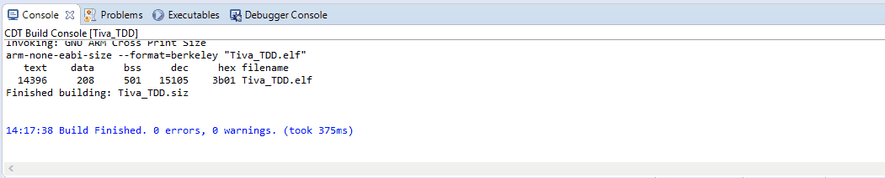

# Tiva_TDD
Test Driven Development minimal project with TI Tiva Launchpad with target-testing features.

### 1 - Overview

This project provides a minimal code structure for developing embedded projects with the Tiva Launchpad board (EK-TM4C123GXL) using the Test Driven Development (TDD) method. The main difference of this design is that all tests are performed directly in the target system (Tiva board), instead of the host (computer). 

To know more about TDD -> https://www.amazon.com/Driven-Development-Embedded-Pragmatic-Programmers/dp/193435662X

### 2 - Implementation

For this approach, the standard input/output paths are retargeted through a special debugging channel called semihosting. In that way, the microcontroller can redirect functions like printf(), puts(), fputs(), scanf() directly to the debug console used in the host development IDE. Instead of needing a dedicated peripheral to implement the communication physical channel (such as UART or USB), only a capable debugger (such as the ICDI) is required for this project.

With this alternative I/O system, plus a library called 'unity' (http://www.throwtheswitch.org/unity) and some support code ('/diag' and '/support' folders), a framework to design and test embedded projects with C language is possible (or any other type of output desired). As expected, the included libraries provide a structured way to write and build features with the TDD mindset comprising the steps:

i) Write a test for a desired feature,

ii) Run the test (failure is expected, since the feature is not written yet),

iii) Develop the desired feature,

iv) Run the test again. If passes, restart the cycle with next feature. If fails, refactor the current feature and test it again.

### 3 - How to use it

All the necessary configurations are provided within the Eclipse project files included with the source code. The following tools were used with the project:

i) **Eclipse IDE**

ii) **openocd-0.8.0**

iii) **SW-TM4C Tivaware for C Series Software (version 2.1.4.178)**

To write a test within the desired module, create a function in the "test_<MODULE>.c" file that starts with "test_" to be recognizable by the test processor, such as:
```
// 2.3. Check if one is equal to two
void test_SysInitModule_BareMetalBlock_Hardware_TestIf_OneIsEqual_ToTwo(void)
{
	uint32_t ui32_ExpectedValue = 2;
	uint32_t ui32_ActualValue = 1;
	TEST_ASSERT_EQUAL_UINT32(ui32_ExpectedValue, ui32_ActualValue);
}
```

If not already written, create the module runner ("test_<MODULE>_runner()") for the module and add all desired tests (RUN_TEST("test_<MODULE>_runner")) in the runner function inside the "test_<MODULE>_runner.c" file:
```
//=======MAIN=====
int test_SysInitModule_BareMetalBlock_Hardware_runner(void)
{
  UnityBegin("test_SysInitModule_BareMetalBlock_Hardware.c");             // Add the test runner as below, for each test
  RUN_TEST(test_SysInitModule_BareMetalBlock_Hardware_TestIf_OneIsEqual_ToTwo);
  RUN_TEST(test_SysInitModule_BareMetalBlock_Hardware_TestIf_ThreeIsEqual_ToThree);
  RUN_TEST(test_SysInitModule_BareMetalBlock_Hardware_TestIf_TestIsIgnored_WithMessage);
  return (UnityEnd());
}
```
  
After that, add the module runner's function call inside the 'MainApp_Test()' function:
```
// Main application test runner
int MainApp_Test(void)
{
	UnitySummary();
	test_SysInitModule_BareMetalBlock_Hardware_runner();    // Add all module runners here
	return(0);
}
```

With the minimal test code ready, flash the program and debug it through the Eclipse IDE. The test summary may resemble something like this:


Next development steps are: (i) write some feature code/functions, (ii) call them inside the test function of the desired module, (iii) compile, flash and debug the program and (iv) repeat the process until the test passes.

When the code is ready for release, the test framework must be bypassed, to do that change the definition TEST for RELEASE in the project properties and organize the developed functions inside the MainApp_Release() function.
